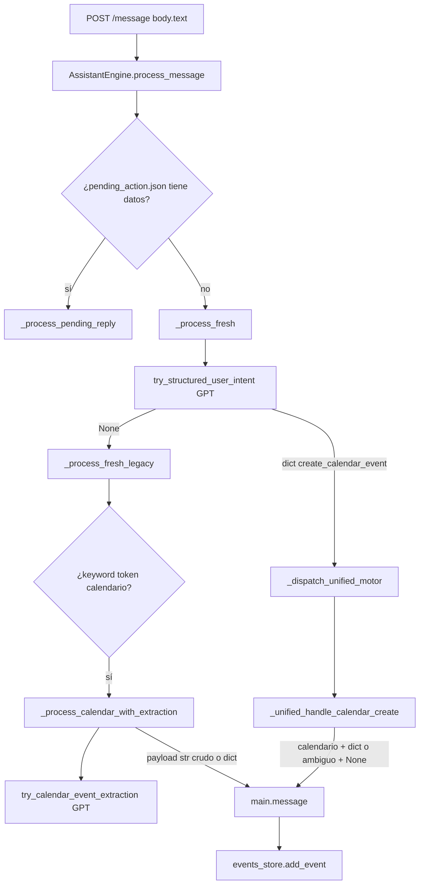

# Auditoría motor calendario heredado v0.21 — backend actual (v0.45a)

Documentación **solo lectura** del flujo real de `POST /message` hasta persistencia en agenda. Sin cambios funcionales.

---

## A. Mapa del flujo actual (`POST /message`)

**Resumen narrativo:**

1. **`main.message`** llama `engine.process_message(body.text)` y obtiene `(reply_text, intent_type, stored_override, ui_hint)`.
2. **`payload`** para persistencia secundaria es `stored_override if stored_override is not None else body.text`.
3. Solo si **`intent_type == "calendario"`** y hay ramificación correspondiente en `main.py`, se llama **`events_store.add_event(payload)`**:
   - **`payload`** puede ser **`dict`** (evento estructurado) o **`str`** (legado): el **`str`** crea un único campo **`title`** igual al texto completo (`add_event(str)`).

---

## B. Tabla — Funciones del motor (assistant_engine.py)

| Función | Rol |
|---------|-----|
| **`process_message`** | Punta de entrada; si hay pending → `_process_pending_reply`; si no → `_process_fresh`. Devuelve cuáduple `(reply, intent_type, stored_override, ui_hint)`. |
| **`_process_fresh`** | Guardas locales (duplicados agenda, foco, follow-ups agenda, bare intents día/nota/tarea/calendario, pregunta «qué tengo el día X»); luego **`try_structured_user_intent`**; si `None` → **`_process_fresh_legacy`**. |
| **`_process_calendar_with_extraction`** | Camino legado **extracción GPT** (`try_calendar_event_extraction`). Si falla o `not_calendar` → **`("calendario", raw)`** como `stored_override`. Si `_calendar_direct_save_ok` → guardado dict vía **`_store_payload_from_cal`**. Si no → **`_pending_calendar_payload`** + pending + respuesta **`ambiguo`** (**sin** `stored_override`). |
| **`_unified_handle_calendar_create`** | Motor **unificado** para `operation == create_calendar_event`. Reglas de blindaje/pending/título/fecha/hora/confianza; puede devolver **`calendario` + dict**, **`ambiguo` + None**, o **`consulta`**. |
| **`_try_complete_pending_calendar`** | Con pending de calendario que admite completado: GPT **`try_complete_pending_calendar_event`** o fallback **`_local_complete_pending_fallback`**; fusiona con **`_apply_completion_updates`**; si listo → **`_save_pending_calendar_now`** (**`calendario` + dict**). |
| **`_pending_calendar_missing_fields`** | Campos críticos obligatorios para «guardable»: `title`, `date_text`, `time_text`; si título genérico o fragmentario → exige **`participants_or_location`**. |
| **`_calendar_ready_to_save`** | `not bool(_pending_calendar_missing_fields(pending))`. |
| **`_unified_pending_payload`** | Convierte **`calendar_event`** del JSON unificado en pending **`pending_kind="calendar_event_completion"`**, **`calendar_structured: True`**, recalcula `missing_fields`. |
| **`_pending_calendar_payload`** | Pending desde resultado de **`try_calendar_event_extraction`** (camino `_process_calendar_with_extraction`). |
| **`_store_payload_from_cal`** | Dict persistible desde extracción legada (`cal`), con coerción horaria v0.44.2 sobre `time_text`. |
| **`_unified_payload_from_event`** | Dict persistible desde `calendar_event` unificado + confianza; coerción `time_text`. |
| **`_saved_calendar_ack`** | Texto de confirmación al usuario a partir del dict guardado (fecha/hora/lugar/participantes). |
| **`_open_calendar_pending`** | Pending **mínima** (`_minimal_calendar_pending_payload`) mensajes tipo bare «agéndame una cita». |

---

## C. Tabla — Llamadas GPT (openai_client.py)

| Función | Cuándo se llama (desde motor) | Prompt / contrato | JSON esperado (idea) | Sin `OPENAI_API_KEY` | Fallo GPT / JSON / normalización |
|---------|-------------------------------|-------------------|----------------------|----------------------|----------------------------------|
| **`try_structured_user_intent`** | `_process_fresh` tras guardas locales | System **`_UNIFIED_INTENT_SYSTEM`**: operaciones `create_note`, `create_task`, `create_calendar_event`, `query_calendar`, `update_calendar_event`, `needs_clarification`, `general_query` + objetos `note`, `task`, `calendar_event`, etc. User: JSON `mensaje_usuario`, `eventos_candidatos`, `evento_enfocado`. | Objeto normalizado por **`_normalize_unified_intent`** (`operation`, `confidence`, `calendar_event`, …). | **`None`** → cae a **`_process_fresh_legacy`**. | **`None`** (log + mismo fallback). |
| **`try_calendar_event_extraction`** | `_process_calendar_with_extraction` (y desde legacy si intent análisis dijo calendario) | System **`_CALENDAR_EVENT_SYSTEM`** (`_CALENDAR_EVENT_*`): `intent` ∈ `calendar_event` \| `not_calendar` + slots título/fecha/hora/… | **`_normalize_calendar_extraction`**: rechaza si `intent` no es uno de esos dos; exige `confidence` numérico. | **`None`** → motor interpreta como fallo extracción. | **`None`** → igual. |
| **`try_complete_pending_calendar_event`** | `_try_complete_pending_calendar` antes que fallback local | System **`_COMPLETE_PENDING_SYSTEM`**; user = pending serializada + texto usuario. | Intent ∈ `complete_pending_event`, `confirm`, `cancel`, `needs_clarification`, `other` + `updates`. **`_normalize_complete_pending`**. | **`None`** → se usa **`_local_complete_pending_fallback`**. | **`None`** → mismo fallback. |
| **`build_agenda_context_packet`** | Sintesis día / follow-ups agenda (`_synthesize_day_agenda`, `_handle_agenda_followup`) | **No GPT**: arma ficha JSON (`user_message`, `relevant_data.events`, foco, contexto persistido). | N/A | N/A | N/A |
| **`try_agenda_context_reasoning`** | Tras **`build_agenda_context_packet`** en rutas de síntesis/revisión agenda | System **`_AGENDA_CTX_REASONING_SYSTEM`**; user = ficha serializada. Salida validada **`validate_agenda_reasoning_result`** (`operation` permitido o fuerza `ask_clarification`). | **`None`** si sin clave | **`None`** si error / JSON inválido |
| **`try_note_structuring`** | Flujo notas pendientes (`assistant_engine`; no es núcleo calendario en esta auditoría) | System **`_NOTE_STRUCT_SYSTEM`** | **`None`** sin clave | **`None`** si fallo |

**Modelo:** por defecto env **`OPENAI_MODEL`** (p. ej. `gpt-5.5`), salvo constantes internas.

---

## D. Tabla — Slots esperados para calendario

### Motor unificado (`calendar_event` en respuesta GPT)

Campos típicos consumidos en **`_unified_handle_calendar_create`** (desde `ev = unified["calendar_event"]`):

| Slot | Uso en motor |
|------|----------------|
| `title` | Obligatorio para flujo «completo» salvo ramas pending sin título pero con otros datos útiles |
| `date_text` | Obligatorio para guardar sin pending de día |
| `time_text` | Obligatorio para guardar sin pedir hora (salvo ramas «todo el día» con alta confianza) |
| `location`, `participants`, `description`, `duration_minutes` | Opcionales; influyen en preguntas genéricas y pending |

### Extracción legada (`try_calendar_event_extraction`)

Normalizado en **`_normalize_calendar_extraction`**: `intent`, `title`, `date_text`, `time_text`, `location`, `description`, `participants`, `duration_minutes`, `source_text`, `confidence`, **`needs_confirmation`** (bool, default implícito True en modelo), `missing_fields`, `reason`.

---

## E. Tabla — Validaciones backend (calendario)

| Punto | Validación |
|-------|------------|
| **`_calendar_direct_save_ok(cal)`** | `intent == calendar_event`; `title` no vacío; `date_text` no vacío; `confidence >= 0.80`; **`needs_confirmation` es False** (implícito: debe ser explícitamente confirmable sin preguntar). |
| **`_pending_calendar_missing_fields`** | Lista vacía ⇒ evento «listo» para `_calendar_ready_to_save`. |
| **`_unified_handle_calendar_create`** | Múltiples ramas: bare calendar sin datos → `_open_calendar_pending`; sin `date_text` → pending + pregunta; sin `time_text` → pending o guardado según tipo título/confianza; título genérico sin lugar/participantes → pending; `conf < 0.80` → pending + «¿Lo guardo?»; si todo OK → **`_unified_payload_from_event`** + ack. |

### Persistencia (`events_store.py`)

| Método | Comportamiento relevante |
|--------|---------------------------|
| **`add_event(str)`** | Crea **`{id, title=str.strip(), created_at}`** únicamente — sin `date_text`/`time_text`. Camino «legado». |
| **`add_event(dict)`** | **`_add_structured_event`**: siempre `title` (default `"Evento"`); opcionales `date_text`, `time_text`, `location`, `description`, `participants`, `duration_minutes`, `source_text`, `confidence`, `needs_confirmation`, `missing_fields`. Omite claves ausentes o vacías según tipo. |
| **`add_calendar_event`** | Alias de **`add_event(dict)`**. |
| **`update_event`** | Fusiona updates sobre evento por `id`; no borra campos si valor omitido; listas `participants`/`missing_fields` con reglas de merge; actualiza `updated_at`. |
| **`get_events`** | Lista cruda desde JSON en disco. |

---

## F. Tabla — Decisiones (guardar / pending / aclaración / fallback crudo)

| Situación | `intent_type` devuelto | `stored_override` | ¿`main.py` llama `add_event`? |
|-----------|-------------------------|-------------------|-------------------------------|
| Motor unificado guarda evento | `calendario` | `dict` | Sí → **`add_event(dict)`** |
| Extracción legada `_calendar_direct_save_ok` | `calendario` | `dict` | Sí → dict |
| Extracción legada pero necesita confirmación / datos | `ambiguo` | `None` | No |
| **`try_calendar_event_extraction` → None o `not_calendar`** dentro **`_process_calendar_with_extraction`** | **`calendario`** | **`str` (= mensaje usuario raw)** | **Sí → `add_event(str)` → evento «pobre»** |
| Pending confirmada `confirm` / `save_as_event` con **`_pending_is_rich_calendar`** | `calendario` | `dict` desde **`_event_dict_from_pending`** | Sí → dict |
| Pending confirmada **`save_as_event`** sin rich calendar | `calendario` | **`content` texto (`_confirmation_saved_reply`)** | **Sí → `add_event(str)`** (riesgo de título = texto libre acumulado) |
| `_confirmation_saved_reply` genérico confirm para calendario no rich | `calendario` | string `content` | Posible **`add_event(str)`** |

---

## G. Identificación exacta del bug (evento «pobre»)

1. **`_process_calendar_with_extraction`** (aprox. líneas 4163–4177 en `assistant_engine.py`):
   - Si **`try_calendar_event_extraction`** devuelve **`None`** (sin API key, error, JSON inválido, normalización rechazada): devuelve **`("He preparado este evento provisional.", "calendario", raw, None)`**.
   - Si devuelve dict con **`intent == "not_calendar"`**: mismo retorno con **`raw`** como tercer elemento.

2. **`main.message`** (aprox. líneas 57–99):
   - `payload = stored_override if stored_override is not None else body.text`
   - Para **`intent_type == "calendario"`**, si **`payload`** no es `dict`, ejecuta **`events_store.add_event(str(payload))`**, que en **`EventsStore.add_event`** crea **`{"title": texto_completo, "id", "created_at"}`** sin `date_text` / `time_text`.

**Conclusión:** el fallo es la **combinación** «`intent_type` forzado a calendario + `stored_override` = texto crudo» sin pasar por pending estructurada.

---

## H. Reglas objetivo recomendadas (v0.45b) — solo diseño

| # | Regla |
|---|--------|
| 1 | **No** usar **`add_event(str)`** como resultado normal de una intención calendario con frase sustantiva del usuario; reservar `str` solo a compatibilidad explícita o tests. |
| 2 | Si **`try_calendar_event_extraction`** falla o dice `not_calendar` pero el enrutado local cree calendario (keywords): abrir **`pending`** estructurada o pedir aclaración, **sin** persistir el `raw` como título único salvo política explícita de «borrador». |
| 3 | Si hay **regex / heurística local mínima** (día + hora en texto, p. ej. ya usada en `_local_complete_pending_fallback`), construir **`dict`** con `title` inferido corto + `date_text` / `time_text` y entonces pending o guardado según confianza. |
| 4 | Alinear **`_process_fresh_legacy`** con motor unificado: reducir divergencia entre «GPT agenda motor» (`try_agenda_intent_analysis`) y camino extracción para que no se bifurque silenciosamente a raw. |
| 5 | Documentar en código el contrato **`stored_override`**: `None` = no persistir entidad calendario en este turno; `dict` = persistir estructura; evitar `str` ambiguo para calendario. |

---

## Referencias de archivo

- [`backend/core/assistant_engine.py`](../backend/core/assistant_engine.py)
- [`backend/core/openai_client.py`](../backend/core/openai_client.py)
- [`backend/storage/events_store.py`](../backend/storage/events_store.py)
- [`backend/main.py`](../backend/main.py)
