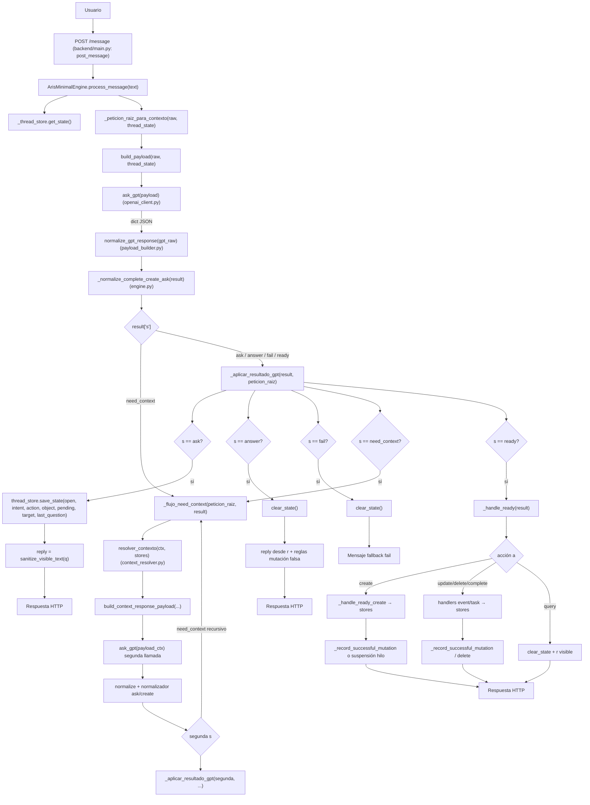

# Diagnóstico — Grafo de lógica actual Aris v0.47

Documento generado por inspección **solo lectura** del código (sin modificaciones ni ejecución de mutaciones de datos). Describe el flujo real del backend mínimo hasta la respuesta al usuario.

**Archivo adicional buscado:** no existe `decision_validator.py` en el árbol actual del proyecto Aris (solo referencias en legacy v0.46 si se inspecciona fuera de este diagnóstico).

---

## 1. Grafo general



### Puntos explícitos del diseño

| Tema | Dónde |
|------|--------|
| **mode=new / continue** | `build_payload()` en `payload_builder.py`: `open is True` → `continue` + `thread`; si no → `new`, `thread=null`, `last_focus`/`last_action` del estado cerrado. |
| **mode=context_response** | Solo en `build_context_response_payload()` (segunda llamada tras `need_context`). |
| **thread** | Incluido en payload si `open`; en `context_response` lleva `intent`, `action`, `obj`, `ctx_requested`, etc. |
| **last_focus / last_action en GPT** | Solo si `mode=new` (`open=false`): se copian desde `thread_state`. Si `continue`, se envían **`null`** según docstring de `build_payload`. |
| **Llamada GPT** | `ask_gpt()` serializa el payload JSON como mensaje usuario; system = `MINIMAL_DECISION_SYSTEM_PROMPT` (`decision_prompt.py`). |
| **Normalización** | `normalize_gpt_response` sanea `s`, `i`, `a`, `obj`, `target`, `pending`, `ctx`, `q`, `r`. |
| **Normalizador ask→ready** | `_normalize_complete_create_ask` sólo promueve `ask/create` a `ready` si la ficha técnica está “completa” (event: ISO + hora + identidad mínima, etc.). |
| **Ejecución mutación** | Ramas `ready` → `_handle_ready` → `add_event`/`update_event`/… en stores. |
| **Estado conversacional** | `ask` abre hilo con `save_state`; éxito mutación → `clear_state` + `save_state` con `last_focus`/`last_action` según caso; `answer`/`fail` suelen `clear_state`. |

---

## 2. Grafo de `payload_builder`

### Funciones relevantes

- `build_payload(raw_text, thread_state)` — payload del turno principal.
- `_local_calendar_date_iso(tz_name)` — fecha civil `YYYY-MM-DD` con `ZoneInfo` (**no** interpreta el texto del usuario).
- `build_context_response_payload(...)` — payload de la segunda vuelta GPT.
- **`recent`**: documentado explícitamente como **no enviado** (docstring líneas 70-70 de `payload_builder.py`).

### Árbol (comportamiento real)

```
build_payload(raw, thread_state)
├── base común
│   ├── raw
│   ├── tz = DEFAULT_TIMEZONE ("Europe/Madrid")
│   ├── locale = DEFAULT_LOCALE ("es-ES")
│   ├── local_date = _local_calendar_date_iso(DEFAULT_TIMEZONE)
│   └── rules = { "hide_internal": True }
│
├── si isinstance(thread_state, dict) y thread_state.open is True
│   ├── mode = "continue"
│   ├── thread = { intent, action, object, last_question, pending, target }
│   ├── last_focus = null
│   └── last_action = null
│
└── si no (open false o ausente)
    ├── mode = "new"
    ├── thread = null
    ├── last_focus = thread_state.last_focus (si dict)
    └── last_action = thread_state.last_action (si dict)
```

### `build_context_response_payload`

- `mode`: **`context_response`**.
- `thread`: resume intención GPT previa (`i`, `a`, `obj`), `last_gpt_status: need_context`, `ctx_requested`, `original_raw`.
- `context`: dict devuelto por `resolver_contexto` (dominio, consulta, filtros, **candidatos**, **count**).
- Mismos `tz`, `locale`, `local_date` que el payload base (reloj servidor en zona por defecto).

---

## 3. Grafo respuesta GPT → motor

Orden en `ArisMinimalEngine.process_message`:

1. `result = normalize_gpt_response(gpt_raw)`
2. `result = self._normalize_complete_create_ask(result)`
3. Si `s == "need_context"` → `_flujo_need_context` (puede llamar GPT otra vez).
4. Si no → `_aplicar_resultado_gpt(result, peticion_raiz)`.

### `_aplicar_resultado_gpt` (ramas)

| `s` | Comportamiento principal |
|-----|---------------------------|
| **ask** | `save_state(open=True, …)` con `intent`/`action`/`object`/`pending`/`target`/`last_question`; respuesta visible = `q` saneada. |
| **answer** | `clear_state()`; respuesta = `r`; validación de claims de mutación sin ejecución (`_answer_claims_fresh_success_mutation`). |
| **fail** | `clear_state()`; mensaje fallback `_MSG_FAIL_FALLBACK`. |
| **need_context** | Reentra en `_flujo_need_context` (otra ronda). |
| **ready** | `_handle_ready(result)`. |
| **otro / desconocido tras normalizar** | En la práctica `normalize` fuerza `fail` si `s` no está en allowlist; ramo final: `clear_state` + fallback. |

---

## 4. Grafo `need_context`

1. GPT devuelve `s=need_context` y `ctx` (dict).
2. `resolver_contexto(ctx_sol, events_store, tasks_store, notes_store)` en `context_resolver.py`.
3. `build_context_response_payload` arma el segundo payload con `mode=context_response` y `context` = salida del resolver.
4. Segunda llamada `ask_gpt`.
5. Nueva `normalize_gpt_response` + `_normalize_complete_create_ask`.
6. Si sigue `need_context` → recursión con límite `_MAX_CONTEXT_NEED_CONTEXT_DEPTH`.
7. Si no → `_aplicar_resultado_gpt` (ask/ready/answer/…).

### Dominios admitidos por `resolver_contexto`

- **Calendario**: `domain == "calendar"` (constante interna `_DOMINIO_CALENDARIO_EN`).
  - Consultas soportadas (**exactas**): `events_by_person`, `events_by_date`, `events_by_person_and_time` (`_CONSULTAS_SOPORTADAS`).
  - Si `query` no está en ese conjunto → lista vacía (0 candidatos).
- **Tareas**: `domain in {"tasks","task"}` → consulta debe ser `list_tasks` con filtros opcionales.
- **Notas**: `domain in {"notes","note"}` → `list_notes` con filtros.

### Filtros calendario (resumen)

Implementados vía `filters` en `_resolver_calendario`: personas (`_filtro_people`), `date`, `time`; emparejamiento **contra campos almacenados** (`date_text`, `date_iso`, `participants`, `time_text`) — **sin** interpretación semántica del lenguaje natural (ver docstring del módulo).

### Vacío y mensajes al usuario

El resolver **no** devuelve la frase «No encuentro ese evento…». Devuelve `count` y `candidatos`. El texto que ve el usuario ante `count=0` en flujo de contexto lo redacta **GPT** en la segunda respuesta (véase guía en `decision_prompt.py` con ejemplo distinto: *«No encuentro eventos con esos datos en tu agenda local.»* — plural, no idéntico al string del engine).

---

## 5. Grafo `i=event` (detalle)

### A) `ready` + `event` + `create`

- Función: `_handle_ready_create` → rama `i == "event"`.
- Pasos: `_event_payload(obj)` → opcional inyección `date_iso` desde claves `cal_date_iso`/`date_iso` → validaciones:
  - `_event_payload_has_calendar_slot_without_iso` → suspensión con hilo `pending.field = cal_date_iso`.
  - `_event_create_has_minimal_identity` → suspensión `cal_identity`.
- Si pasa: `events_store.add_event(ev_payload)` → `_record_successful_mutation(domain="event", action="create", …)`.
- **No** aparece aquí el texto «No encuentro ese evento en tu agenda local.»

### B) `ready` + `event` + `update`

- Función: `_handle_ready_update_event`.
- `tid = extract_event_target_id(result)` (`target` o `pending.target`).
- Si no `tid`: *«No sé qué evento quieres modificar…»*.
- Si `get_event_by_id(tid) is None`: **exactamente** *«No encuentro ese evento en tu agenda local.»* (`engine.py`, ~978-984).
- Si hay updates vacíos: mensaje de captación; si OK → `update_event` → `_record_successful_mutation` con `action="update"`.

### C) `ready` + `event` + `delete`

- Función: `_handle_ready_delete_event`.
- Sin `tid`: pregunta por concreción.
- Si `get_event_by_id` None o `delete_event` falla: **misma frase** «No encuentro ese evento en tu agenda local.» (`engine.py`, ~663-678).

### D) `ready` + `event` + `query`

- `_handle_ready`: `clear_state`, respuesta = texto `r` saneado (GPT genera la respuesta informativa).

### E) `need_context` / `context_response` → luego `event`

Dependerá de la segunda respuesta GPT; si termina en `ready`+`update`/`delete` con `target` inválido, se aplica el mismo mensaje del apartado B/C.

---

### Origen exacto de: «No encuentro ese evento en tu agenda local.»

| Ubicación | Condición |
|-----------|-----------|
| `ArisMinimalEngine._handle_ready_update_event` | `s=ready`, `i=event`, `a=update`, `target` resuelto pero **no existe** fila con ese `id` en `events_store`. |
| `ArisMinimalEngine._handle_ready_delete_event` | `s=ready`, `i=event`, `a=delete`, mismo caso, o fallo de borrado. |

**No** hay otra aparición de esta cadena literal en `backend/` fuera de `engine.py` (búsqueda en árbol principal). El legacy v0.46 usa variantes similares pero no es el motor actual.

---

## 6. Grafo `i=task` (contraste)

- **create**: `_handle_ready_create` → `_task_payload` → `tasks_store.add_task` → `_record_successful_mutation`.
- **update**: `_handle_ready_update_task` — requiere `target` (mismo `extract_event_target_id`), valida existencia, construye parches desde `task_*` y alias; hilo si falta valor.
- **delete**: `_handle_ready_delete_task` — mensajes distintos («tarea»).
- **complete**: `_handle_ready_complete_task`.
- **query**: igual patrón que evento: `clear_state` + `r`.

`last_focus`/`last_action`: mismas reglas globales tras mutación exitosa; **no** se reenvían a GPT en `mode=continue` (van en `null`), pero el **prompt** puede haber instruido uso prudente del foco cuando `mode=new`.

---

## 7. Grafo `i=note`

- **create**: sólo `_handle_ready_create` con `_note_payload` → `add_note`; no hay ramas `update`/`delete`/`complete` para `note` en `_handle_ready` (acciones distintas caen en `_MSG_UNSUPPORTED_MODIFY` / `_MSG_UNSUPPORTED`).
- **query**: `ready` + `query` muestra `r` y cierra estado (no lista notas desde engine salvo que GPT lo narre en `r`; el resolver puede haber sido usado vía `need_context` antes).

---

## 8. Grafo `last_focus` / `last_action`

| Evento | Comportamiento |
|--------|----------------|
| **Tras mutación exitosa create/update/complete** | `_record_successful_mutation`: `clear_state()`, luego `save_state({last_focus, last_action})` con blob enriquecido (`object`, `changed_fields`, `result`, …). |
| **Tras delete** | `discard_focus_matching` si el foco apuntaba al id borrado; `clear_state()`; `save_state({last_action})` (**no** renueva `last_focus` al borrado). |
| **Enviados a GPT** | Solo cuando `mode=new` (`build_payload`: hilo cerrado). Con hilo abierto: **forzados a `null`**. |
| **clear_state** | `thread_state_store.py`: conserva `last_focus` y `last_action` del documento previo al limpiar campos operativos del hilo. |
| **Suspensiones (`cal_identity`, `cal_date_iso`)** | `save_state` con `open=True` sin pasar por `_record_successful_mutation` → **no** actualizan `last_focus`/`last_action` por esa vía (merge con estado previo). |

---

## 9. Reconstrucción del fallo observado

**Entrada:** *«cita para el martes a la 14h con luis»*

### 1) Payload esperable (con hilo cerrado previo)

- `mode`: **`new`** (si `thread_state.open` es false).
- `thread`: **`null`**.
- `last_focus` / `last_action`: valores persistidos previos (**si los hay**) — pueden incluir otro evento/tarea/nota tocada antes (riesgo para el modelo si los usa como `target`).
- `local_date`, `tz`, `locale`: según defaults del builder.

*(Si el hilo hubiera estado abierto, `mode=continue` y no se habrían enviado foco/huellas — escenario distinto.)*

### 2) Respuesta GPT “ideal” (no observada)

Coherente con contrato prefijado (ejemplo ilustrativo):

```json
{
  "s": "ready",
  "i": "event",
  "a": "create",
  "obj": {
    "cal_title": "cita con Luis",
    "cal_date_text": "martes",
    "cal_date_iso": "…",
    "cal_time_text": "14:00",
    "cal_people": ["Luis"]
  }
}
```

El engine entonces ejecutaría `create` (sujeto a validaciones civiles + identidad mínima ya implementadas).

### 3) Qué respondió GPT realmente para producir ese texto

Sin logs de modelo **no es posible afirmarlo**. Por **evidencia de código**, la cadena vista **solo** se emite si el motor ejecuta **`ready` + `event` + (`update` o `delete`)** y el **`target`** apunta a un id **inesistente** en `events.json` actual.

**Hipótesis plausibles (ordenadas):**

| ID | Hipótesis | Probabilidad relativa |
|----|-----------|-------------------------|
| **A** | GPT devolvió `ready` / `event` / **`update`** con `target` = UUID equivocado (p. ej. copiado de `last_focus` de otro ciclo ya no válido o alucinado). | **Alta** (única ramificación que genera ese literal de forma determinista). |
| **B** | GPT devolvió `ready` / `event` / **`delete`** con el mismo problema de `target`. | Media-alta |
| **C** | Flujo `need_context` seguido de segunda respuesta GPT que terminó en `ready`/`update`|`delete` con `target` inválido (misma condición terminal). | Media |
| **D** | `s=answer` con `r` conteniendo **exactamente** la misma frase: posible pero **menos típico** porque el modelo tendría que copiar el wording del backend; las guías del prompt sugieren formulación cercana pero distinta cuando `count=0` en consultas. | Baja-media |

### 4) Pun donde una ficha “nueva” puede convertirse en update/delete

- **Único decisor**: el JSON que devuelve **GPT** (`s`, `i`, `a`, `target`). El backend **no** reclasifica una frase nueva en “create vs update”: solo valida técnico y ejecuta.
- **`last_focus`**: cuando `mode=new`, llega como contexto; si el modelo asocia incorrectamente esa huella como `target` de una modificación sobre un evento que ya **no existe** localmente → fallo observable.
- **Normalizador interno**: `_normalize_complete_create_ask` sólo opera sobre **`ask/create`** ciertos dominios; **no corrige** un `ready/event/update` erróneo.
- **`extract_event_target_id`**: toma cualquier UUID en `target` o `pending.target` que pase normalización → si existe y no hay fila, mensaje exacto anterior.

Norma práctica deducida: el **punto de inflexión** es la **clasificación GPT** antes de cualquier llamada al store (salvo bifurcación `need_context` previa).

---

## 10. Puntos débiles del grafo (sin corrección aquí)

| # | Archivo / función | Riesgo | Posible línea futura (solo idea) |
|---|---------------------|--------|----------------------------------|
| 1 | `engine.py` — sin capa previa que contraste **create vs update** | Cualquier `ready/event/update` con `target` erróneo termina en “no encuentro ese evento” aunque el `raw` sea inequívocamente creación. | Validación opcional tipo “solo update si existe id” antes de ejecutar — implica política que hoy rechaza como “semántica local”. |
| 2 | `payload_builder.build_payload` — `last_focus` en **new** | El modelo puede anclarse a UUID previo cuando el usuario declara nueva cita/datos fuertes. | Refuerzo sólo prompt (ya hubo trabajo v0.47.36.7) o señalar en payload reglas tipo `rules`. |
| 3 | `context_resolver` — consultas muy rígidas | `events_by_*` devuelven [] si la query literal no coincide; GPT puede ciclar mal en `need_context`. | Ampliación de queries o mejor contrato GPT↔filtros documentado. |
| 4 | `normalize_gpt_response` + `_normalize_complete_create_ask` — no tocado `update`/`delete`/`query` | Errores de intención en esas ramas van directos a ejecutar (o mensaje técnico seco). | Validador opcional tras JSON (usuario citó algo tipo `decision_validator` que **no existe** aún aquí). |
| 5 | `ready`/`query` borra estado sin persistir consulta útil | Lista real de agenda en consultas puede no alinearse si GPT solo improvisa texto. | MCP/herramienta de listado estable o plantillas de datos en `need_context`. |
| 6 | Diferenciación typo hora («a la 14h») | Pertenece a GPT; backend no corrige español antes del modelo. | — |

---

## 11. Referencias rápidas de archivos

| Archivo | Rol |
|---------|-----|
| `backend/main.py` | `POST /message` → `engine.process_message` |
| `backend/core/payload_builder.py` | `build_payload`, `normalize_gpt_response`, `extract_event_target_id`, payloads `context_response` |
| `backend/core/openai_client.py` | `ask_gpt` |
| `backend/core/engine.py` | Orquestación, ramas, stores, texto «No encuentro ese evento…» |
| `backend/core/decision_prompt.py` | Políticas GPT |
| `backend/core/context_resolver.py` | Resolución técnica `need_context` |
| `backend/storage/thread_state_store.py` | `save_state`, `clear_state`, foco/huellas |
| `backend/storage/events_store.py` | CRUD eventos |
| `backend/storage/tasks_store.py` / `notes_store.py` | CRUD resto |
| `backend/models/schemas.py` | `UserMessage`, `AssistantResponse` |
| `scripts/smoke_backend_minimal_v047.py` | Regresión documentada de contratos (no altera flujo en runtime) |

---

*Fin del diagnóstico. Sin commits asociados a este archivo.*
